<style>
.list-group-item.active, .list-group-item.active:focus, .list-group-item.active:hover {
    background-color: #EA5933;
}
</style>

<style>
.nav>li>a {
    position: relative;
    display: block;
    padding: 10px 15px;
    color: #EA5933;
    font-weight: bold;
}
.nav-pills>li.active>a, .nav-pills>li.active>a:hover, .nav-pills>li.active>a:focus {
    color: white;
    background-color: #EA5933;
}
</style>


<script> 
    $(document).ready(function() { 
    $head = $('#header'); 
    $head.prepend('<A href = https://www.cuttingedge-events.com></A>') 
    }); 
</script> 


```{r echo=FALSE, message=FALSE,warning=FALSE}
library(readxl)
library(dplyr)
library(knitr)
```

# MEETING SPACES {.tabset .tabset-fade}

## Martitim museum

The architectural complex of the Drassanes Reials de Barcelona, the seat of the Maritime Museum of Barcelona, is one of the most important civil gothic industrial buildings still standing. It is a first-class cultural facility located in the historic centre of Catalonia’s capital, perfect for hosting events. It has several unique, multi-purpose spaces that the Museum offers to companies and organizations for holding the opening and closing of congresses, conferences, presentations, gala suppers, fairs, exhibits, shows, conventions, and all manner of events.

*Venue available from 10AM to 1AM*

<br>

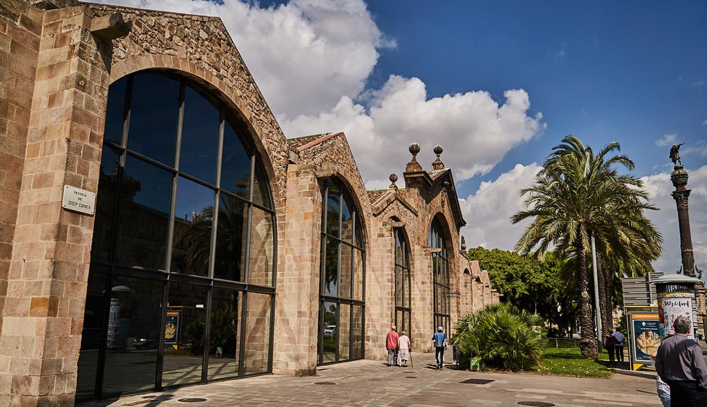

<br> 

*Museu Marítim de Barcelona is located at Drassanes zone, just crossing the road in front of Barcelona's port.* 

<iframe src="https://www.google.com/maps/d/u/0/embed?mid=1Nlhla2hss_0YMUCaEoVvWJyr99Z0a1t6" width="100%" height="480"></iframe>

<br>

The Maritim Museum of Barcelona features different meeting spaces of different proportions each. It has in total more than 3.000 sq. meters of meeting spaces. Please, find above, the general map of the whole space with the 4 different meeting spaces; *Sala Gran*, *Botigues*, *Auditorium* and *Jardí del Museu*. Only *Sala Gran*, *Botigues* and *Auditorium (but is too small)* allows meetings. 


***Please, find the information detailed of two meeting space***

<br>

### Sala Gran

This recently-restored, 17000sq. meters hall is 300 years old, and with its columns rising up to support the roof, is one of the most characterístic and spectacular spaces in the Royal Dockyards. 

* **Floor area**: 1.700 square meters. Room with columns. 

* **Capacity**: 800 for banquet, 920 in theater and 920 in cocktail.

* **Services included**: Central heating / air conditioning, Power outlet and security. 


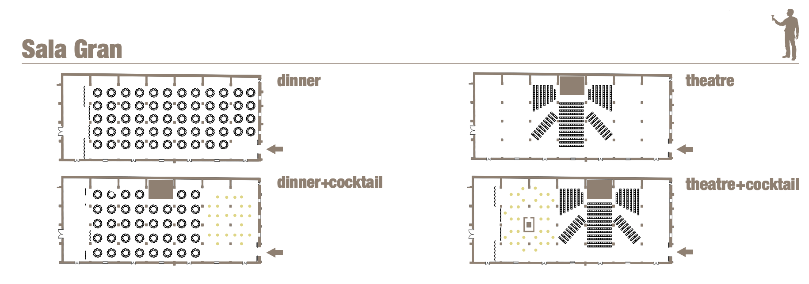

<br>

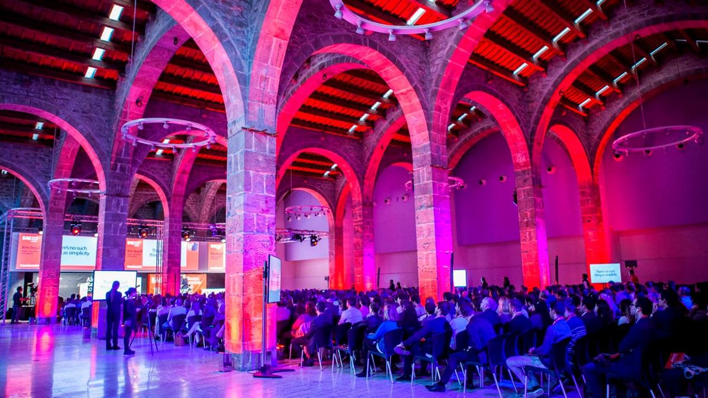

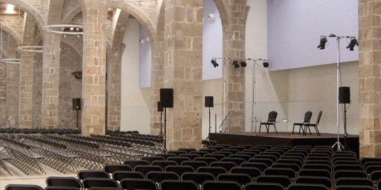

### Botigues de la Generalitat

A space that forms part of the 15th century building, and which contains "botigues" or storerooms for storing the equipment required for sailing the galleys. This room is perfect for exhibitions. 

* **Floor area**: 550 square meters. 

* **Capacity**: 200-300 depending on the exhibition

* **Services included**: Central heating / air conditioning, power outlet and security.

<br>


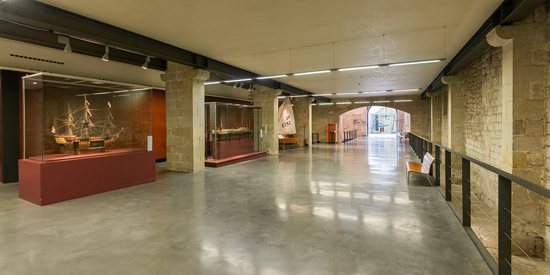

### Museum gardens

The garden at the entrance to the Drassanes Reials is an open-air space perfect for holding receptions, aperitifs, cocktail parties or coffee breaks.

* **Floor area**: 650 square meters. 

* **Capacity**: 800 people

* **Services NOT included**: Cleaning and waste collection

*Please note to stage shows (including musical performances), prior authorisation from the Consorci de les Drassanes Reials de Barcelona is required.*

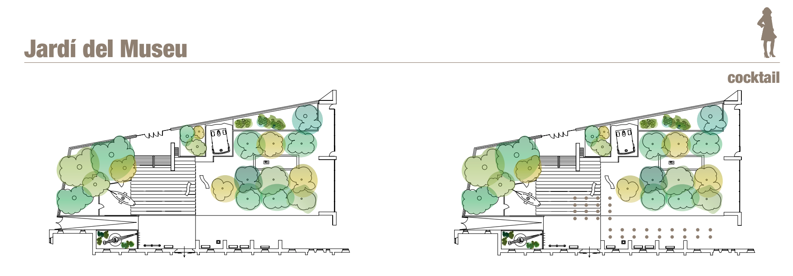

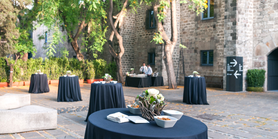

## MNAC (National Museum of Contemporanean Art) {.tabset .tabset-fade}

The Palau Nacional, constructed for the International Exposition of 1929, is the location of the Museu Nacional d'Art de Catalunya. The Palau Nacional, which just about extends to 50,000 m2, is a building of major proportions, which relates to models of academic classicism of the period within the ambit of the universal exposition. Its façade is crowned by a large dome, inspired by that of St Peter’s of the Vatican; two lesser domes on either side, and four towers inspired by the Cathedral of Santiago de Compostella.

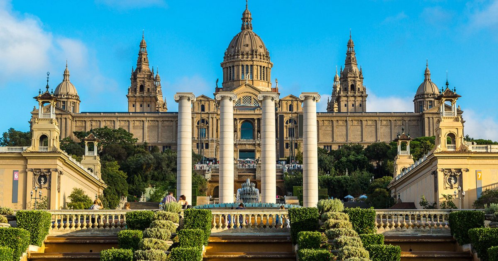

<br>
lIt is located on the hill of Montjuïc, a privileged setting from which you can enjoy magnificent and unique views of Barcelona. The front access to the Palau Nacional is reached by a major stone staircase from the avenue of Reina Maria Cristina, flanked half way up by the major luminous and monumental fountains by Carles Buïgas.

<iframe src="https://www.google.com/maps/d/u/0/embed?mid=10BG4Hv5wK_PPbkq6y2iS8eH9ZmqqI0WR" width="100%" height="480"></iframe>

The Palau Nacional is one of the most emblematic spaces of Barcelona. Since its inauguration in 1929, on the occasion of the International Exposition and its subsequent transformation into a museum, the building has been the setting for numerous events that have marked both the social life of Barcelona and that of the international companies that have trusted in it.The Palau Nacional offers the possibility of renting out some of its spaces.

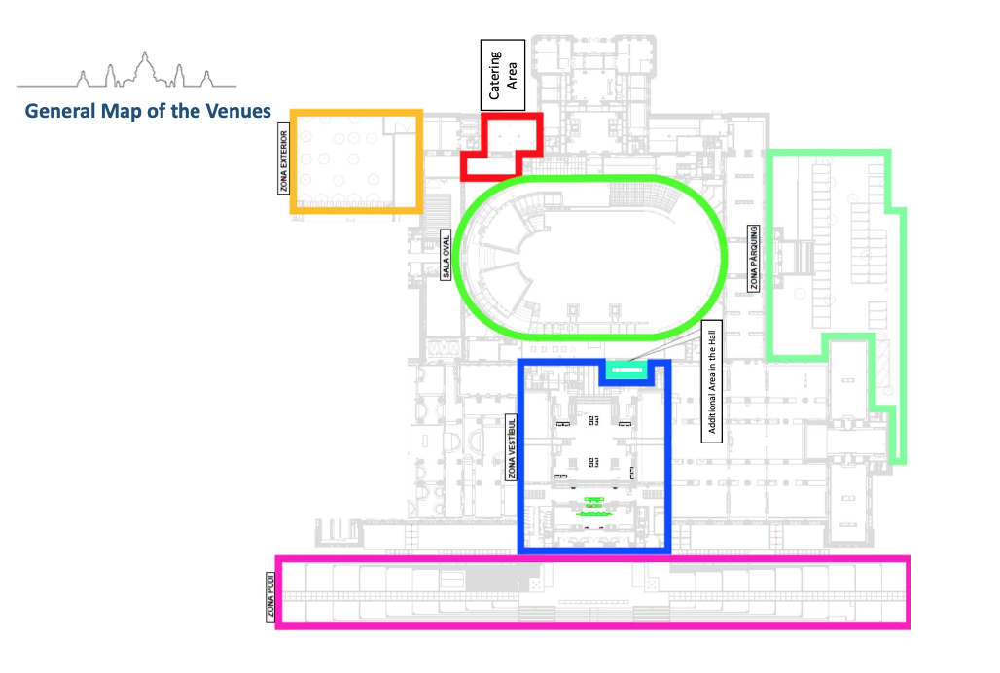

*There is one room that fits to your request bigger than 550 square meters*

### Sala Oval

Sala Oval is one of the biggest halls for social events in Europe. Worth highlighting is the immense dome, which allows the entrance of natural light, and the organ, 34 metres long and 11 metres high, that overlooks the hall from the balcony. A multi-purpose space, ideal for opening and closing congresses, for gala dinners, cocktail parties, incentives, concerts, awards ceremonies, presentations, and all types of events.  

* **Floor area**: 1.500 square meters. 

* **Capacity**: 1.400 people (theater and concert format, cocktail) and 500 people  (amphitheatre)

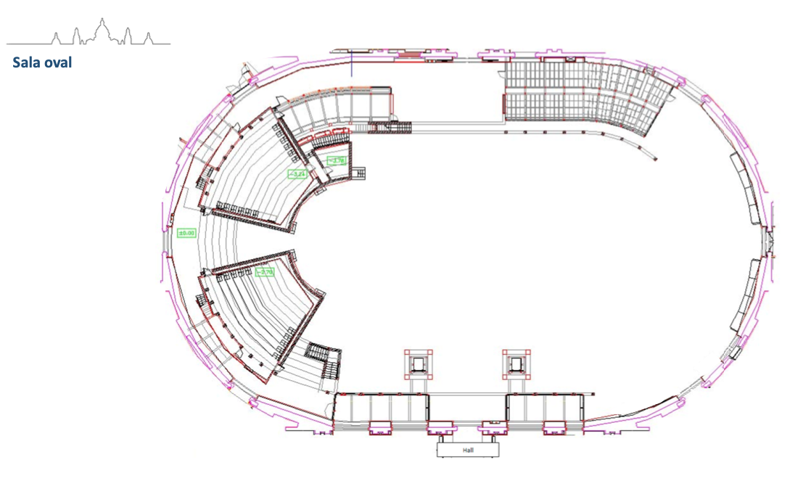

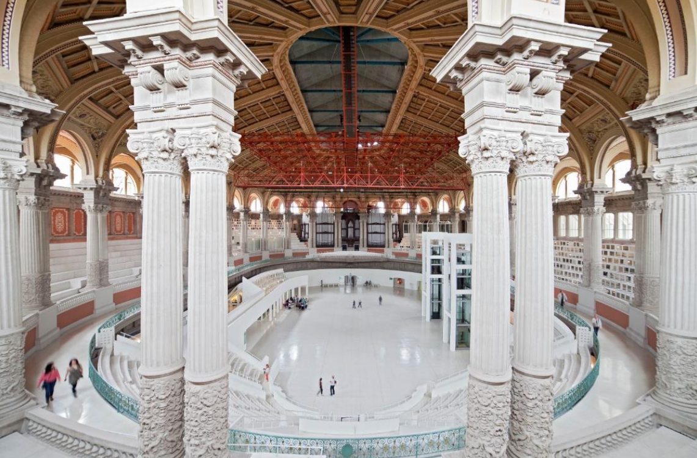 

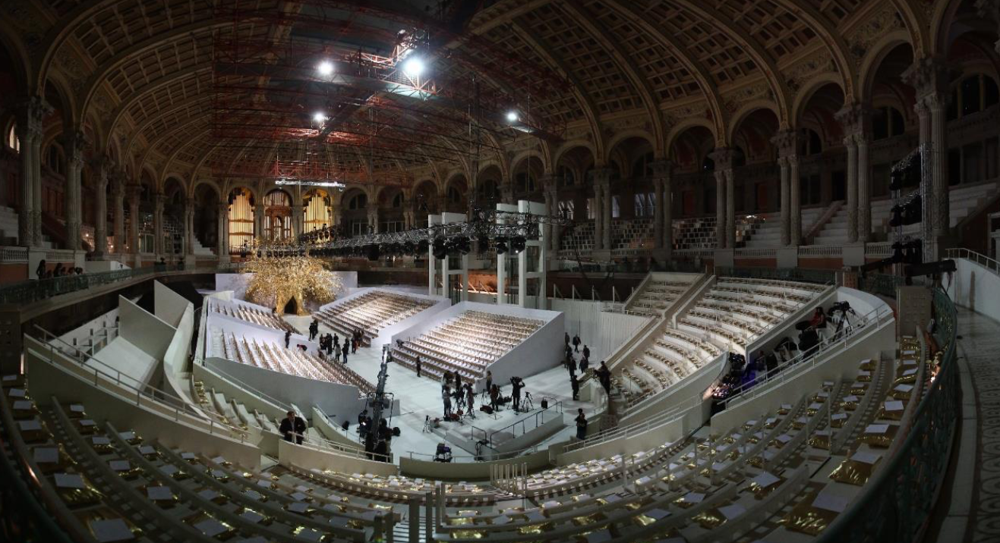 

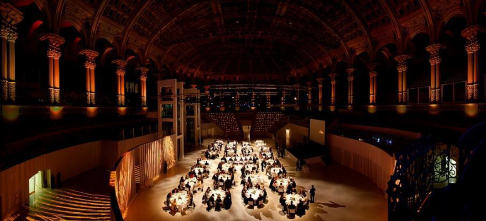 

## Fira Montjuic {.tabset .tabset-fade}

Fira Barcelona has multiple venues distributed in two buildings. The Montjuïc building is located right in the city center and offers industrial style spaces from the beginning of the 20th century and surrounded by icons of Barcelona such as the Magic Fountain of Montjuïc, the National Palace, the Mies van der Rohe Pavilion and Las Arenas. The Gran Via site is a project by the architect Toyo Ito, 2013 Pritzker Prize and avant-garde style. We suggest you a couple of spaces from this buildings:

### Corner Plaza Espanya

The corner Plaza Espanya was built in the 1990s to host the Olympic Games of Barcelona 92. It is located in the heart of Barcelona and surrounded by emblematic buildings such as Las Arenas, the Fountains of Montjuïc and the National Palace. the Corner Plaza Espanya has an adjoining room distributed among offices, networking area and conference room for 80 people in theater fromat, as well as an information desk, a cloakroom counter and a multipurpose room of about 100m2.

* **Floor area**: 3.200 square meters. 

* **Capacity**: 1.120 people. 

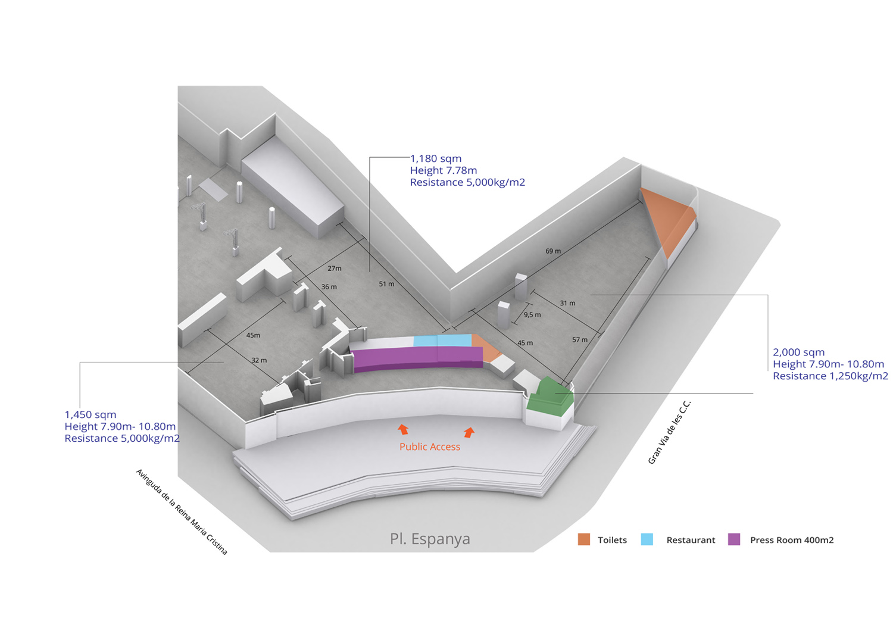

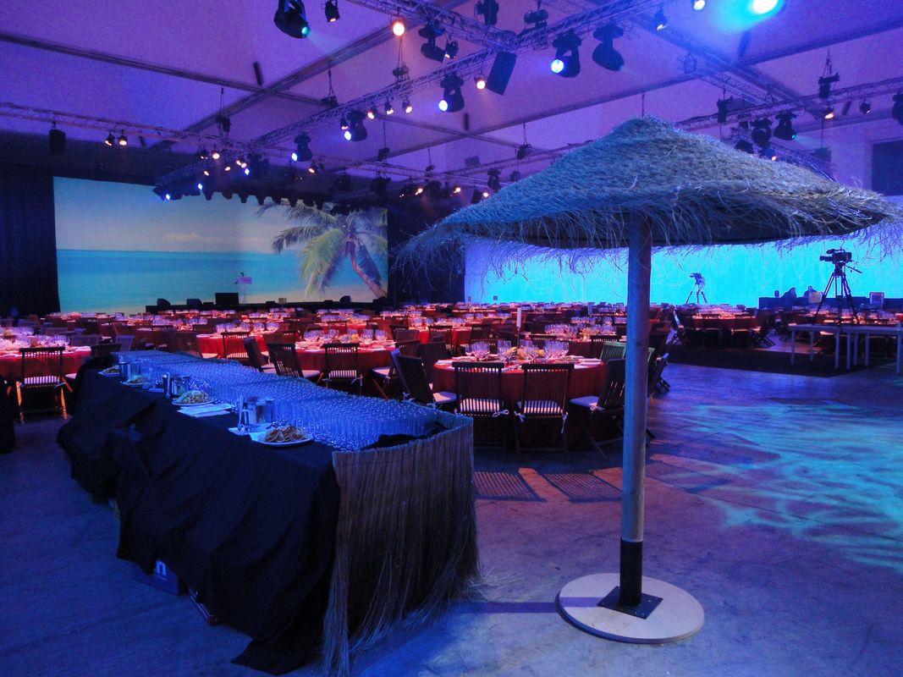

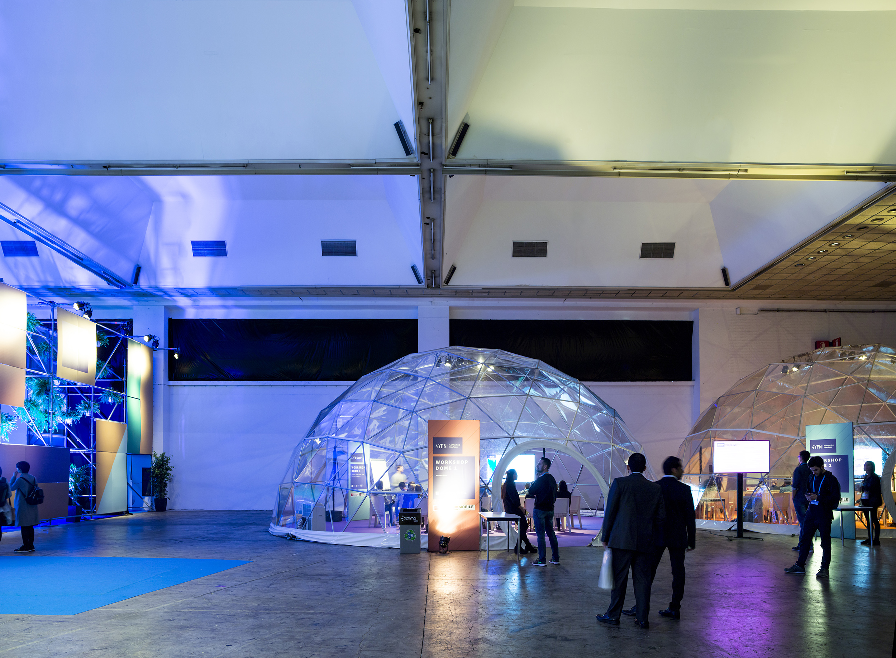

### Italian Pavilion

The Italian Pavilion is the largest and most open space in the city center.  It is located in a privileged location, just in front of the emblematic Magic Fountain of Montjuïc, designed by the architect Carles Buïgas 1929, with its popular show of water, light and music; a must of Barcelona at an international level.

* **Floor area**: 2.400 square meters. 

* **Capacity**: 2.000 people. 

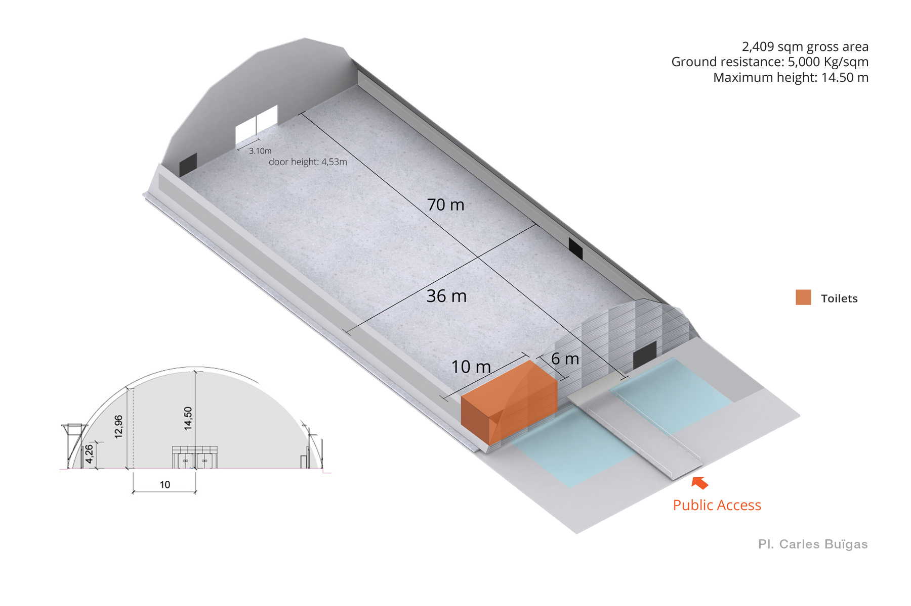


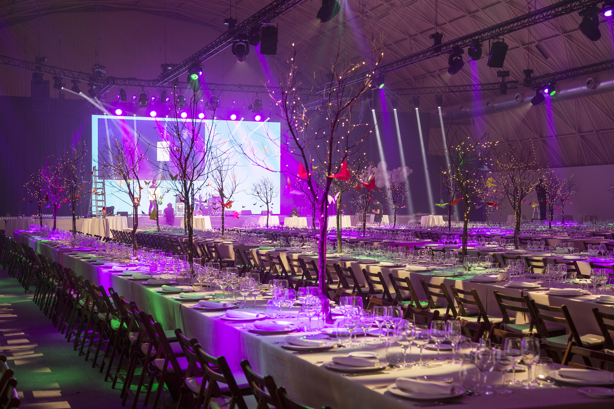


## Caves Rondel  {.tabset .tabset-fade}

Located only 15 minutes outside of Barcelona, an intricate symphony of arches and vaults surround the unique complex, ’El Celler’, a 5700㎡ with a capacity for 3000 banquet guests. 

Cavas Rondel is a good setting for your event, it is a versatile and multi-purpose venue that can be used to host all kinds of corporate events such as product launches, business meetings, press conferences, showrooms, teambuilding exercises, gala lunches and dinners and more.

It is an impressive iconic venue that will leave you with fond memories of an enjoyable and successful event.

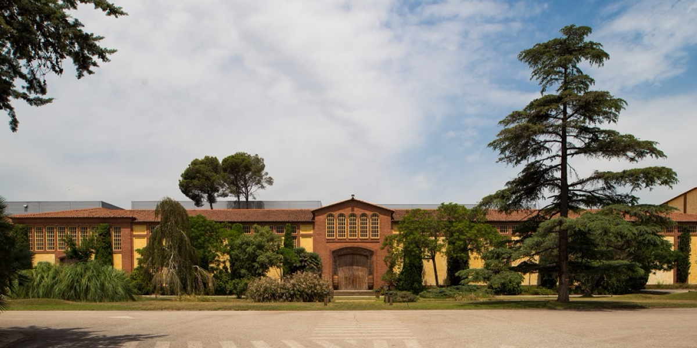

<iframe src="https://www.google.com/maps/d/u/0/embed?mid=17VecLLyxQQsm3Z1s6hD9Xuw4PhhT8IX5" width="100%" height="480"></iframe>

### El Celler

The impressive concrete structure of *El Celler* room and its multitude of flowing arches was constructed by the engineer Jaime Artigas.
With a surface area of over 5700㎡, it is a highly adaptable venue with countless possible uses. 

* **Floor area**: 5.700 square meters. 

* **Capacity**:4.000 people (theater and concert format, cocktail) and 3.000 people  (banquet)

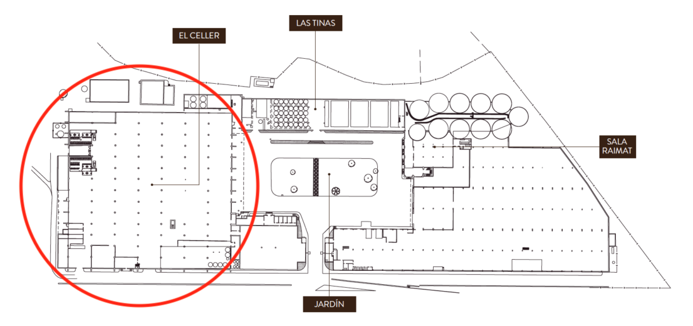

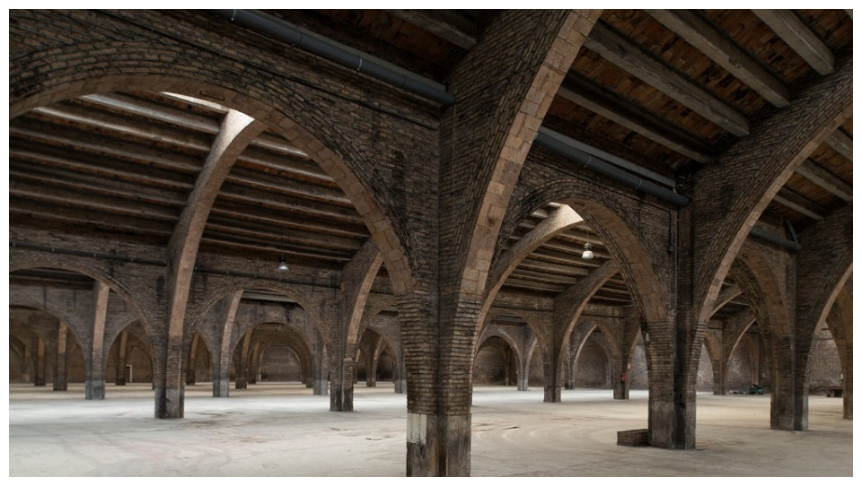

<iframe width="100%" height="480" src="https://www.youtube.com/embed/RNhXuJcG7tA" frameborder="0" allow="accelerometer; autoplay; encrypted-media; gyroscope; picture-in-picture" allowfullscreen></iframe>


# TERMS AND CONDITIONS

  * No reservation has been done. Availability upon request.
  
*****


